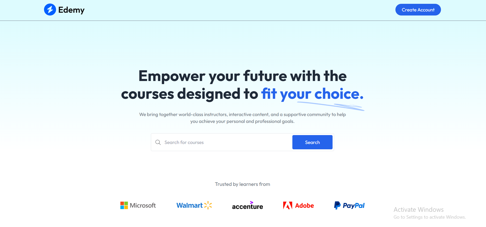
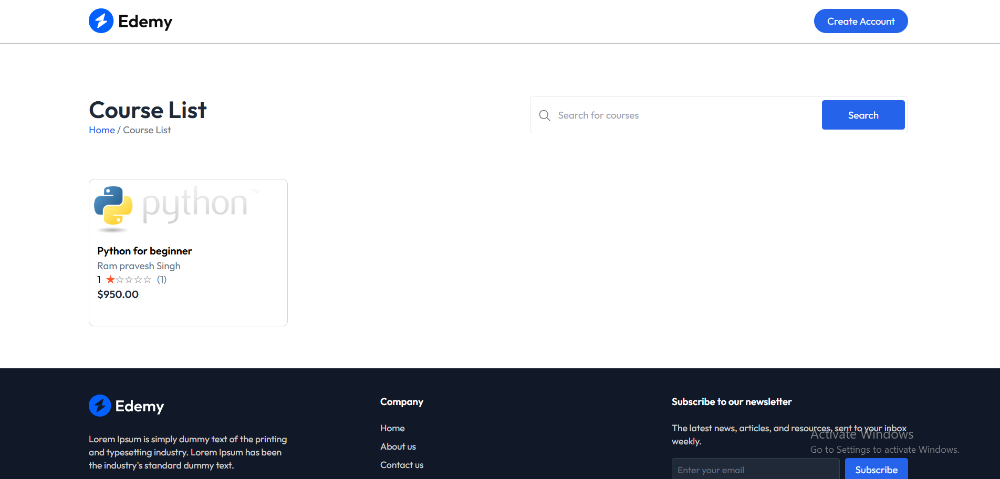
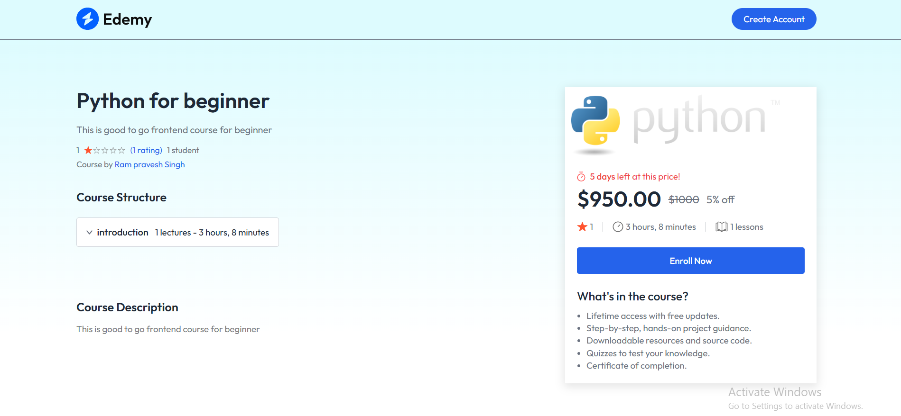
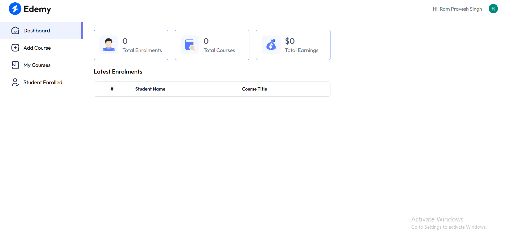
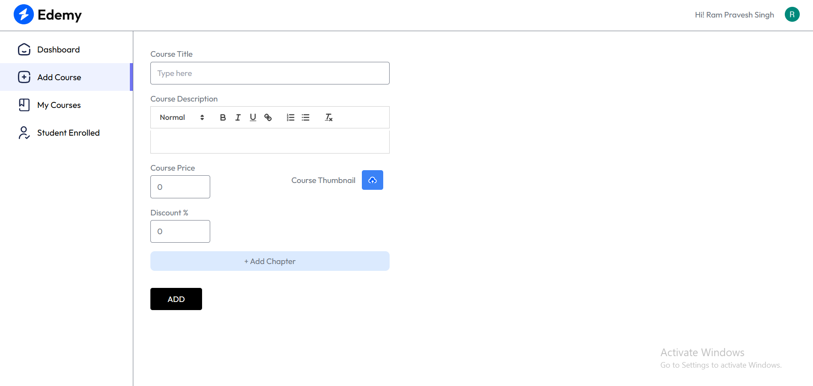
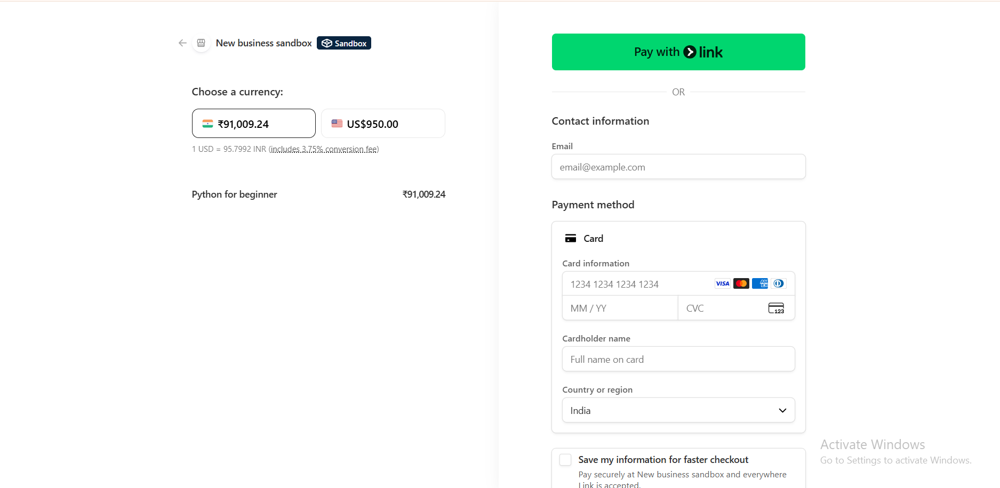

# 📚 Learning Management System

A full‑stack LMS platform that allows instructors to create and sell
courses while enabling students to enroll and track learning progress.

## 🌐 Live Demo

🚀 https://lms-frontend-delta-nine.vercel.app/

## 🚀 Tech Stack

-   React.js
-   Node.js
-   Express.js
-   MongoDB
-   Redux Toolkit
-   Tailwind CSS
-   Clerk Authentication
-   Stripe Payments
-   Vercel

## 📸 Screenshots

### Homepage

### Course Listings Page

### Course Details Page

### Educator Dashboard

### Add Course

### Payments

## ✨ Key Features

-   Instructor dashboard for creating and managing courses
-   Student dashboard for enrolled courses
-   Role‑based authentication using Clerk
-   Secure course purchase with Stripe
-   Video lessons and course modules
-   Learning progress tracking system
-   Responsive UI built with Tailwind CSS

------------------------------------------------------------------------

# ⚙️ Project Setup

## Prerequisites

Install Node.js and setup MongoDB Atlas.

## Server Setup

1.  Configure MongoDB connection
2.  Setup Clerk authentication
3.  Configure Stripe payment gateway

## Run Project

Install dependencies

    npm install

Run development server

    npm run dev

## Author

Ram Pravesh Singh
